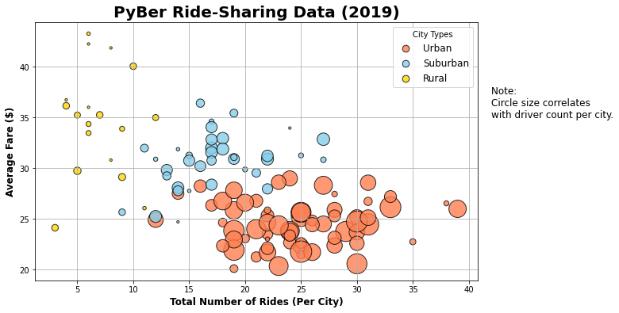
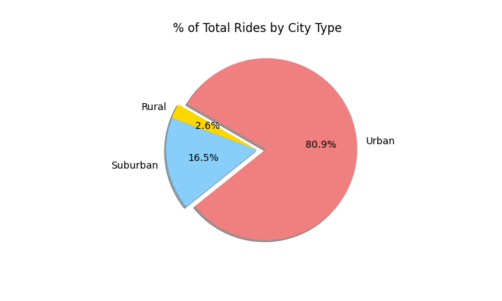
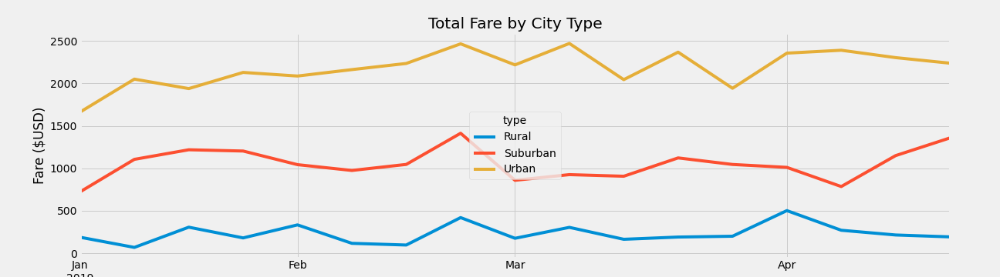

# PyBer_Analysis
## Project Overview
The purpose of this project is to utilize Pyber ride-sharing data to gain an understanding of the relationship between the amount of ridership, weekly fares metrics and the type of cities. By using Pandas and Matplotlib, Pyber ride-sharing data can be visualized with graphs which can assist decision-makers at Pyber to improve ride-sharing access and affordability for underserved neighborhoods. 
## Results
### The average fare per ride and driver by city type

-The graphs show that there is a negative correlation between the numbers of rides and the fare of the rides. The average fare per ride decreases as there are more ridership.  

### The percentage of total rides by city type

- Urban cities amounted to over 2/3 percentage (68.4%) of the total Pyber rides where suburban has a little less than 1/3 percentage (26.3%) and rural cities has 5.3% of the total rides. 

### The percentage of total drivers by city type

- The percentage of total drivers in Urban cities is about 4/5 percentage (80.9%) of the total Pyber drivers count. Suburban has 16.5% of the total drivers count and rural has a small percentage at 2.6%. 

### The percentage of total fares by city type

- According to the data, Urban cities amounts to 62.7% of total fares accounting for most of the company's earning. Surbuban cities amounts at 31% and rural cities amounts at 6.8%. 

### These are several findings according to the graph above:
### Summary DataFrame
 - Urban cities have 2.6x more total rides than Suburban.
 - Urban cites have 5x more total drivers than Suburban cities.
 - Suburban cities have 6.3x more total drivers than Rural area. 
 - Suburban cities have 5x more total rides than Rural area.
 - Rural cities have the highest average fare per ride and also average fare per driver. 
 - The total rides to total drivers ratio for urban city is  1: 1.5, for suburban is 1.3 : 1 and for rural is 1.6 : 1. 

### Multiple Line Chart

- For Rural and Suburban cities it can be observed that the total fares towards the end of the month and the start of the month is significantly more the second and third week of the month. This could be due to people spending more on rides after receiving their monthly paycheck. 
- The urban weekly total fare is around 12 and 2 times higher than rural and surburban ones respectively.

## Business Recommendations 
- In urban cities it is understandable that there might be more options of transportation such as the metro, bikes and commuting by walking. Even though Urban cities accounts for a little less than 2/3 of company's earnings the company could better utilize the amount of drivers in the Urban areas. The total rides to total drivers ratio for urban citeis is 1 : 1.5. There are currently more drivers than rides being ridden. Ceo of Pyber could consider doing promotions for urban riders to encourgage them to use Pyber more. If more rides were taken in Urban cities due to promotion, it could bring down the total Rides to total drivers ratio and increase ridership and average fare for drivers as well. 
- In rural cities there are more demand for rides than there are drivers. This finding is from looking at the ratio of 1.6 : 1 of the total rides to total drivers. People in Rural cities would benefit more in accessibility and affordability of Pyber service since people in rural area might have longer distances to travel and limited modes of transportation. We can also see tha rural has the highest average fare compared to Urban and Suburban's average fare. The Ceo could implement some incentives to draw in more drivers so total rides demand can be met which will also lower down the average fare price for consumers.  

- While having number of rides, fares and cities types data is essential, having the duration the ride data could be helpful in further analysis. It could be useful in calculating average fare per mile or minute of each city types so CEO of Pyber can make better and precise decision on what kind of program or incentives Pyber can draw to bring more ridership in Urban areas and more drivers in rural area.

