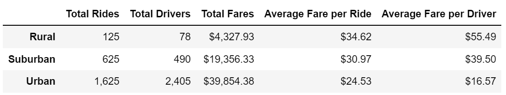

# PyBer_Analysis
## Project Overview
The purpose of this project is to utilize Pyber ride-sharing data to gain an understanding of the relationship between the amount of ridership, weekly fares metrics and the type of cities. By using Pandas and Matplotlib, Pyber ride-sharing data can be visualized with graphs which can assist decision-makers at Pyber to improve ride-sharing access and affordability for underserved neighborhoods. 
## Results

According to the graph shown above, the data shows that Urban citiies have significantly more total rides compared to suburban and rural. The number of total rides in Urban, suburban and rural cites, relatively, is 1,625 rides, 625 rides and 125 rides. However, the total rides to total drivers ratio for urban city is 1: 1.5 , where as suburban total rides to total drivers ratio is 1.3 : 1 and rural has 1.6 to 1 ratio. With the ratio data, it shows that there are a lot more drivers in Urban cities than there are rides whereas rural area has more demand for rides than there are drivers. 

Results: Using images from the summary DataFrame and multiple-line chart, describe the differences in ride-sharing data among the different city types.
